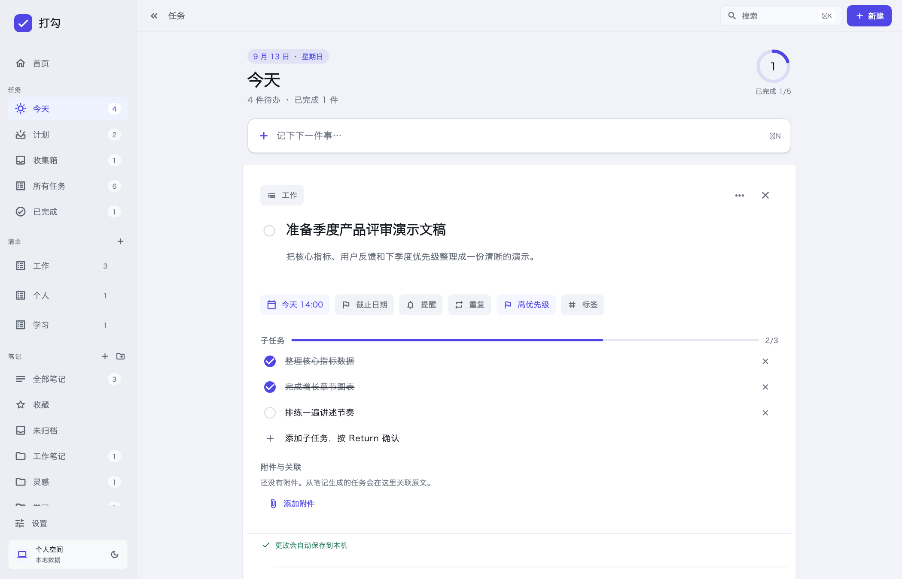
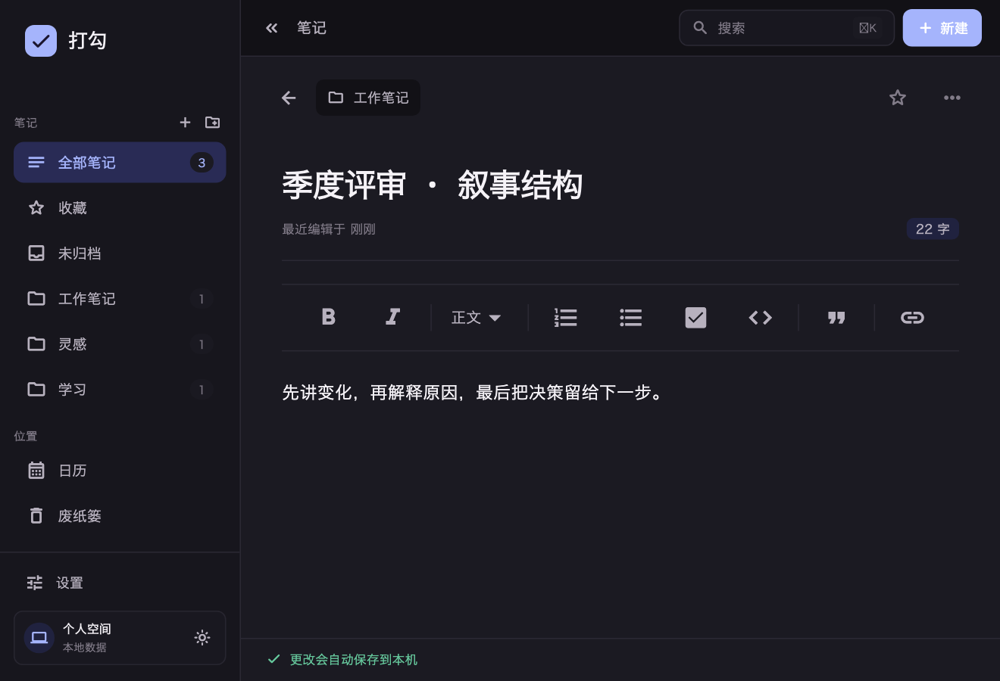

# macOS 任务与笔记改造记录 · 2026-09-13

## 这次解决什么

前几轮围绕缺陷和功能按钮补齐，任务的阅读、编辑、改期与返回没有形成稳定的流程；笔记只有纯文本能力。此次以日常使用为入口重做界面和交互，保留已有数据模型、原生菜单、通知与本地保存能力。

参考了 Things 的简洁任务列表与日期概念、Todoist 的任务属性组织，以及 Bear 的写作工作区。参考的是交互原则，当前代码是本项目自己的 Flutter 实现。[Things 功能](https://culturedcode.com/things/features/)、[Things 安排日与截止日](https://culturedcode.com/things/support/articles/2803579/)、[Todoist 任务视图](https://www.todoist.com/zh-CN/help/todoist/features/use-the-task-view-to-manage-tasks-in-todoist-eDeRDO0C)、[Bear 2 编辑器](https://blog.bear.app/2023/07/bear-2-is-here/)。

## 已落地的体验

| 场景 | 新行为 |
| --- | --- |
| 打开应用 | 默认进入“今天”；新空间无演示任务，预览模式独立存储 |
| 浏览任务 | 普通行突出标题，清单和日期作为次要信息；完成项折叠 |
| 编辑任务 | 点击后在原列表展开卡片；标题、备注、属性、子任务在同处编辑；窄窗口单页返回 |
| 安排时间 | 一个桌面弹出面板完成手动日期、日历、快捷日期和可选时刻；取消不落盘 |
| 区分日期 | 安排日、截止日、系统提醒独立保存；全天与 00:00 明确区分 |
| 改期 | 离开当前视图时提示去向，并提供“查看任务” |
| 查找任务 | 搜索、关联任务、提示操作可直接定位并展开对应任务 |
| 批量改期 | 使用同一日期面板，保留明确的全天/时刻选择，撤销恢复原日期及时刻 |
| 笔记写作 | 接入真实富文本编辑；标题、正文、格式、列表、链接可编辑并持久化 |
| 笔记整理 | 搜索、收藏、文件夹、排序；文件夹重命名同步笔记，删除文件夹保留笔记 |
| 笔记联动 | 选中文字生成任务，保留来源笔记，关联任务可回到任务编辑 |
| 数据管理 | 设置分类可切换；导出含本地附件，备份可选择恢复，恢复前保留当前快照 |
| Mac 入口 | 原生显示名和图标统一为“打勾”，菜单栏录入等现有能力继续保留 |

## 界面

以下为实际 Flutter 组件使用示例数据生成的渲染图。正文、日期、按钮和图标均来自本轮代码。

### 任务列表

### 点击后在原处编辑

### 单一日期面板

### 笔记工作区

### 最小窗口、深色外观

## 验证证据

- 全部自动化测试：63 项通过，含原有 52 项以及新增 11 项产品流程测试。
- 新增检查覆盖：新空间为空、独立截止日期、全天/午夜时刻、富文本保存后重开、附件导出再恢复、改期后的去向、取消日期草稿、笔记切换、设置分类、窄窗口外部跳转、文件夹整理、批量时刻与撤销。
- 使用 1400×900、1000×700、880×600 的组件窗口验证布局；检查了任务、日期、笔记的浅色与深色渲染结果。
- `dart analyze` 无错误；图片粘贴使用的 Quill API 有 2 条实验性接口提示，另有 24 条原有弃用提示。
- 打包脚本会从内部框架到主应用重新完成本地签名，修复 Flutter 增量构建留下的旧签名，随后执行完整校验。
- macOS Release 构建通过，生成约 51.3 MB 的通用应用（Apple Silicon / Intel），本地签名校验通过。测试源码在 `desktop/test/product_flow_test.dart`。
- 本轮没有完成锁屏状态下无法操作的原生 UI 验证。全局热键、通知实际投递、中文输入法和文件选择器需要在解锁的 Mac 上完成实机确认。

## 仍明确保留的范围

导入表格可以查看并保留结构，尚未提供单元格编辑。Web 端历史附件仍需原有附件地址可访问。桌面原生附件和粘贴到正文的图片会进入可导出的本地数据。

本轮交付是可运行的本机应用包，尚未完成 Developer ID 公证和自动更新发布。已有 Web/后端暂存修改及 `frontend/src/views/SettingsPage.vue` 的合并冲突未纳入本轮改动。

原有评估和验收文档用于保留历史记录，当前交互基线以本文与实际代码为准。

## 布局重设计（2026-09-13 追加）

在上述功能改造完成后，又对任务、笔记、首页等页面的布局做了一轮整体重设计，交互逻辑与数据结构不变：

- **统一视觉底座**：内容区改用画布底色 + 白色卡片；新增 `AppCard`、`PageHeader`、`ProgressRing`、`EmptyHint`、`StatCard` 等共享组件（`lib/widgets/app_surfaces.dart`），明暗两套令牌同步微调。
- **任务列表**：头部改为“日期徽标 + 大标题 + 进度环”（已完成 n/m）；按“之前安排 / 今天 / 已完成”分组渲染为连续卡片（分组卡片由逐行滚动子项拼装，保证长列表下 `ensureVisible` 与行内编辑器展开的精确定位）；行改为圆形复选框 + 优先级旗标 + 元信息图标；批量操作栏改为底部浮动卡片；短窗口自动切换紧凑头部。
- **任务编辑器**：行内展开与窄窗详情统一为分区结构（标题与备注 → 属性胶囊 → 子任务（带进度条）→ 附件与关联），从笔记生成的任务显示来源卡片。
- **笔记页**：左栏为画布底上的笔记卡片（标题、两行预览、时间与文件夹胶囊、收藏星标）；编辑页为大标题 + 元信息行（最近编辑时间 + 字数胶囊）+ 富文本正文 + 关联任务列表。
- **首页**：问候语 + 日期头部，新增“今天待办 / 今日完成 / 逾期 / 笔记”四张统计卡（可点击跳转），面板网格统一为带图标的卡片，迷你日历保留全部日期。
- **侧栏与工具栏**：导航项、清单项、计数徽章样式统一；工具栏融入画布底色；日历与废纸篓页配色与卡片语言对齐。

验证：63 项自动化测试全部通过；`dart analyze` 无错误与警告（仅保留既有的 Quill 实验性接口与弃用提示）；`flutter build macos --debug` 构建通过；截图见 `docs/screenshots/`（含新增的 `home-dashboard.png`）。
