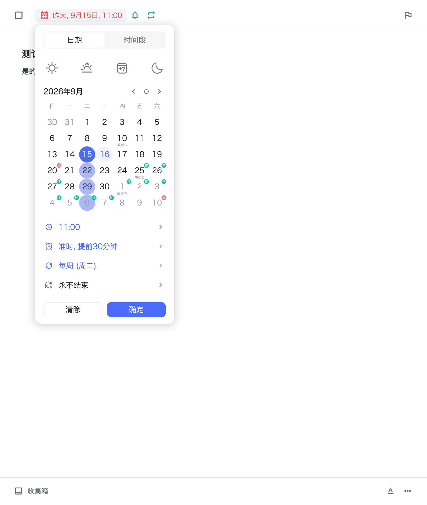
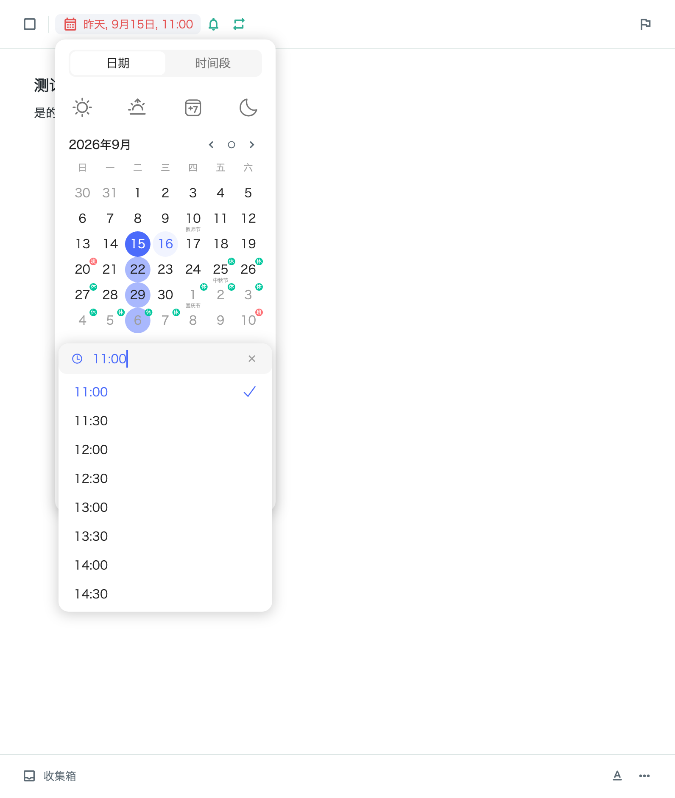
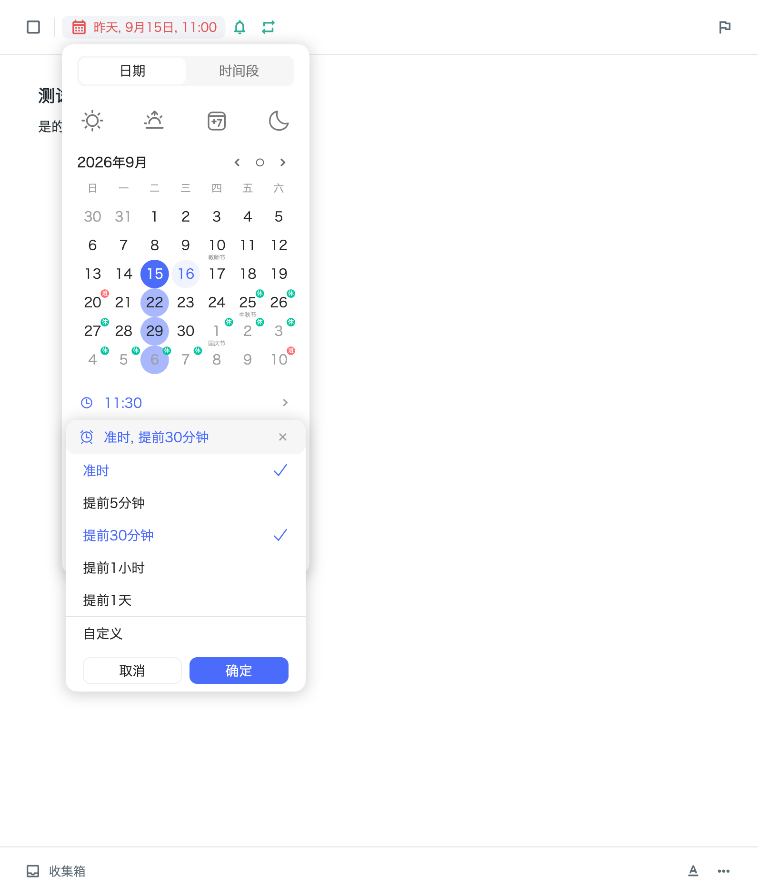
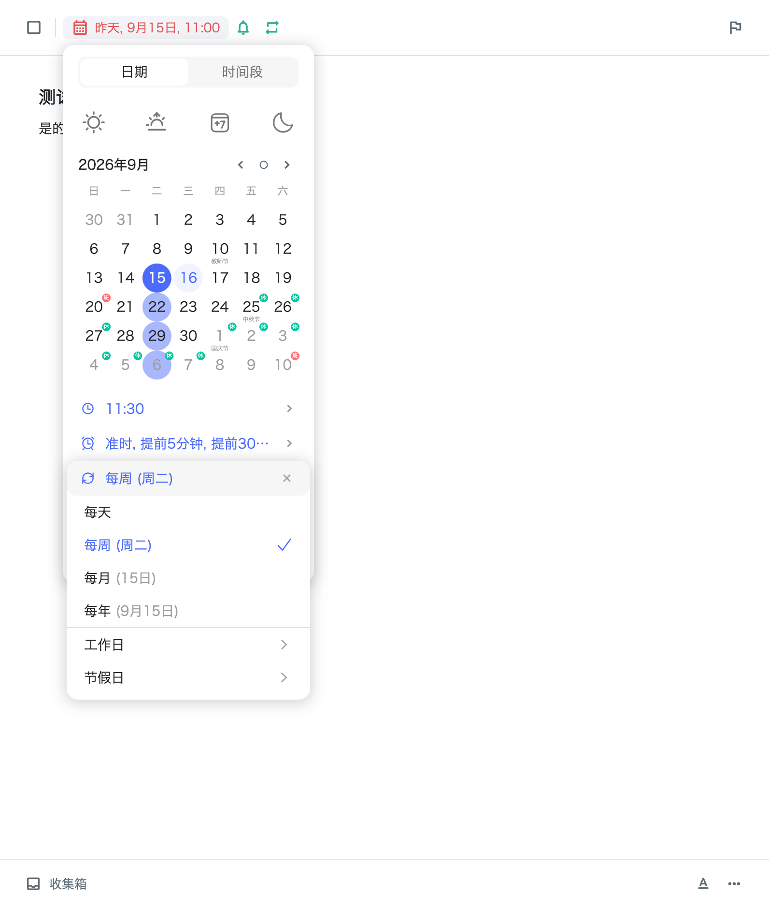
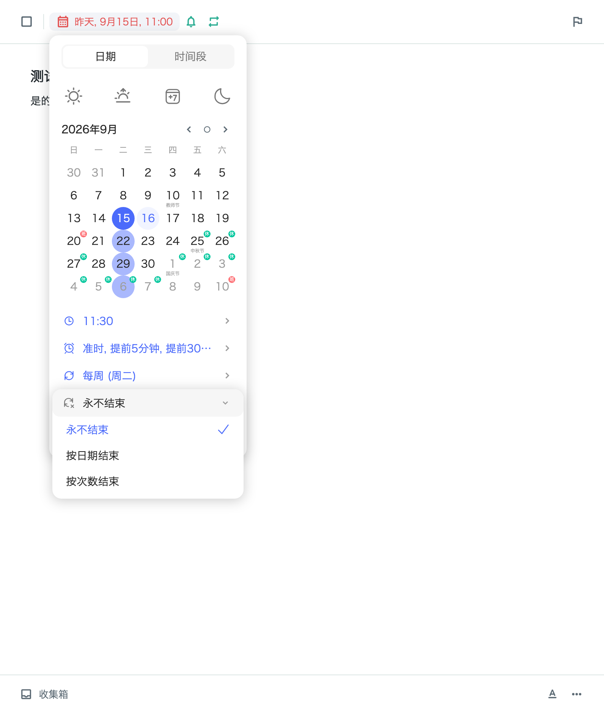

# 日期弹框：五图对照与验收

分支：`feature/flutter-personal-desktop`。本次依据用户最后提供的五张日期截图，替换原先的全天开关、绝对提醒日期弹框和重复频率表单。

## 对照结果

| 区域 | 布局与文字 | 实际行为 |
| --- | --- | --- |
| 时间 | 灰色活动行、蓝色时钟与 HH:mm、右侧清除；下拉列表贴着行展开，每项 34pt，右侧选中勾 | 可输入任意有效分钟；列表以半小时为间隔；清除恢复全天；时间段可分别编辑起止时间 |
| 提醒 | 准时、提前5分钟、提前30分钟、提前1小时、提前1天；自定义；取消／确定 | 多选；自定义分钟／小时／天；取消恢复原选择；确认后的多项值回显在属性行 |
| 重复 | 每天、每周 (周几)、每月 (几日)、每年 (几月几日)；分隔后工作日、节假日子菜单 | 完成或跳过本次后生成下一次；工作日子菜单区分普通周一至周五和含调休的工作日；节假日子菜单区分周末和含调休的休息日 |
| 结束条件 | 重复开启后出现第四行；永不结束、按日期结束、按次数结束 | 结束日期包含当天；次数包含当前这一次，下一次生成时递减；达到条件后停止生成 |
| 日历 | 周日起始、六周网格；选中日深蓝，后续重复日浅蓝，今天淡蓝；节日与班／休小标记 | 预览与实际任务生成使用同一套日期计算；结束条件会限制预览；没有对应日的月份使用月末，闰年日期同理 |
| 主弹框 | 260pt 宽、白底圆角阴影；14pt 属性文字、16pt 细线图标；底部清除／确定 | 所有修改先保存在弹框草稿；主弹框取消时不写入任务；确定统一保存；清除删除日期、时间段、提醒与重复规则 |

菜单从活动属性行展开并覆盖下方内容，避免把主弹框撑成长表单。窄窗口会限制高度并滚动，底部空间不足时向上展开。确认按钮、选中勾、输入光标使用日期菜单的蓝色。

## 提醒与存储

- 新提醒保存为相对任务日期的分钟偏移，例如 `[0, 30]` 对应准时和提前30分钟。移动任务日期后，两次提醒一起移动。
- 全天任务以当天 09:00 计算提前量，提醒菜单显示这一规则。
- 旧的单个绝对提醒仍可读取；可换算为提前量时，日期弹框会转换为对应选项。
- macOS 通知使用每条提醒各自的标识，但点击通知仍打开同一任务。完成、删除、清除提醒时，撤销这个任务的全部待发送通知。
- 过去的重复日期可以保存提醒设置，只登记未来的系统通知。

## 日历数据与已知差异

2025、2026 年班／休安排分别依据[国务院2025年放假通知](https://www.forestry.gov.cn/c/www/szxx/594663.jhtml)与[国务院2026年放假通知](https://big5.www.gov.cn/gate/big5/www.gov.cn/zhengce/content/202511/content_7047090.htm)。节日日期参考[香港天文台2026年公农历对照表](https://www.hko.gov.hk/tc/gts/time/calendar/pdf/files/2026.pdf)和[2025年中秋赏月资料](https://www.info.gov.hk/gia/general/202509/29/P2025092600739p.htm)。这里只使用天文台资料核对节日日期，调休规则仍使用中国大陆通知。

- 调休表目前覆盖 **2025—2026 年**。其他年份法定选项按普通周一至周五／周末计算，子菜单中有说明；未来新通知需要更新表。
- 逐日农历未加入；当前显示截图涉及的节日名称和已核实年份的节日。
- 最右侧“日历＋右箭头”快捷图标的行为尚未得到确认，暂未加入；没有将推测的“跳过本次”绑定给它。
- 未取得参考产品原始图标与字体，图标以代码绘制，平台字形可能略有差异。

## 验证

- 完整回归：219 项通过；随后最终日期截图交互专项通过。
- 静态分析：无错误，保留既有 4 条 Quill 实验 API 警告及 4 条设置面板弃用提示。
- macOS Debug 构建通过，使用项目当前 Flutter 3.47.4。

- 日期组件测试覆盖半小时选时、手动分钟、无效时间提示、多提醒取消／确认／清除、自定义提前量、按日期／次数结束、主弹框取消、起止时间和窄窗口。
- 规则测试覆盖每年闰日、月底、包含结束日、重复次数耗尽、调休工作日、提醒往返存储、日期变化后重新登记通知，以及完成任务后的提醒继承与清除。
- 多通知调度使用记录器验证，未把该测试当作系统通知实际送达的验证。
- 五张截图由真实 Flutter 组件在 796×940 逻辑尺寸、2倍像素下渲染，使用本机中文字体。

## 实际组件截图

### 主弹框

### 时间

### 提醒

### 重复

### 结束条件

