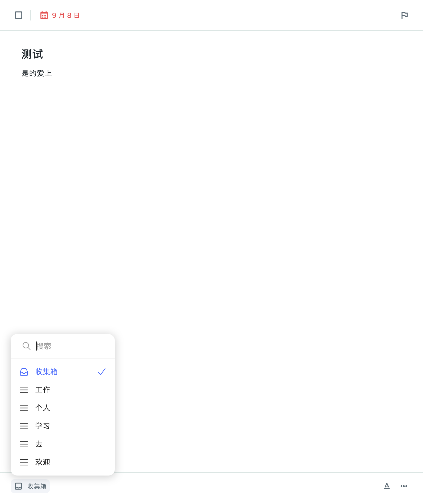

# 任务编辑器：四个弹框对照验收

分支：`feature/flutter-personal-desktop`。依据用户依次提供的清单、日期、文本样式、更多四张截图校准。用户确认：任务动态、保存为模板、打印本轮不补；删除创建副本、复制链接、打开便签和四角框；时钟用于在光标处插入当前时间。

## 逐项检查

| 弹框 | 本轮调整 | 已验证的行为 |
| --- | --- | --- |
| 清单 | 196px 宽，纯白搜索区，14px 文字、18px 细线图标、34px 行高；选中清单的图标、文字与勾均为蓝色；从左下按钮向上打开 | 搜索筛选、键盘提交、切换清单、Esc 取消 |
| 日期 | 260px 宽；日期／时间段分段控制；今天、明天、七天后、今晚快捷图标；周日起始的六周日历；圆形选中态；时间、提醒、重复三行；底部清除与确定 | 切换月份、全天和具体时间、起止时间、嵌套提醒和重复、确认统一保存、取消不落盘、一次撤销；重新安排保留时间段长度，清除时去掉结束日期 |
| 文本样式 | 444×38px，正文下方居中；H、粗体、高亮／检查项、无序、有序／斜体、下划线、删除线、分割线、时钟／链接、代码、引用／附件；18px 细线图标 | 标题选择与正文恢复、重复点击取消格式、检查项默认未完成、选区保持；时钟提供年月日、年月日时分、时分，在原光标处插入；链接可用于选中文字或直接插入网址 |
| 更多 | 独立 164px 菜单，14px 文字、18px 图标、34px 行高；按截图顺序显示添加子任务、置顶、放弃、标签、上传附件，分隔后转换为笔记、删除 | 添加子任务并聚焦输入、置顶切换、放弃与恢复、标签、附件、转换笔记、删除及现有撤销能力；菜单键盘选择与 Esc |

统一调整圆角、阴影和打开时的按钮背景。正文排版继续采用上一轮文字方案的左边距与标题间距。日期、清单与更多使用按钮锚点；格式栏以正文区域中心定位，窄窗口内横向滚动。

原有低频能力继续可访问：提醒／重复移至日期弹框；关联笔记保留在 `/` 菜单；截止日期和专注记录曾移入 `/` 菜单。2026-09-16 傍晚按参考图把 `/` 菜单收敛为固定十二项（一级／二级／三级标题、无序列表、有序列表、检查项、引用、水平分割线，分隔后附件、子任务、标签、关联任务/笔记），两项低频命令随之退出该菜单：专注记录仍由工具栏的专注计时按钮进入，截止日期的入口待定（原先只有 `/` 菜单一条路径）。

## 仍有差异／缺失

- **任务动态、保存为模板、打印**：按用户选择，本轮未实现，也未展示不可用菜单项。
- **清单分组、分组展开箭头和独立的清单 Emoji 图标**：现有模型仅支持平铺清单，不能复制参考图中的“欢迎”分组结构。菜单显示工作区真实清单。
- 日期弹框已在后续五图校准中补充重复日期预览、节日名称和 2025—2026 年调休标记，详见 [日期弹框验收](task-date-popover-2026-09-16.md)。逐日农历仍未实现。
- 系统字体与字形渲染存在平台差异，细线图标根据参考形状重新绘制，未取得参考产品的原始图标资产。

## 验证说明

- 全量 `flutter test --no-pub`：209 项通过。
- 最终弹框截图与交互专项：5 项通过。
- `dart analyze lib test`：无错误；保留既有 4 条 Quill 实验 API 警告、4 条设置面板弃用提示。
- macOS Debug 构建通过。

专项覆盖：四个弹框定位；清单搜索和移动；日期范围及嵌套设置的取消、保存、撤销；格式开关；三种时间插入；窄窗口深色主题；子任务插入期间重绘不覆盖文档；低频入口迁移。

截图由真实 Flutter 组件在 796×940 逻辑尺寸、2 倍像素下渲染，使用本机中文字体。系统附件选择器和系统通知投递仍由既有平台实现承接，本轮没有把单元测试当作系统投递或输入法实机验证。

## 实际渲染截图

### 清单

### 日期

### 文本样式

### 更多

### 当前时间格式

